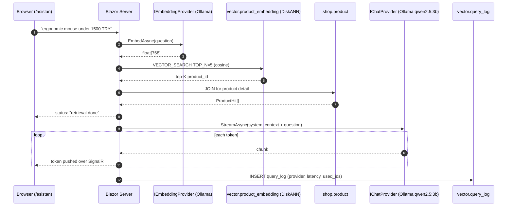
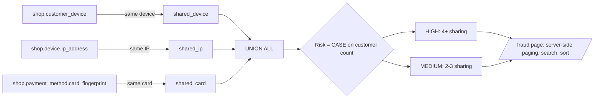
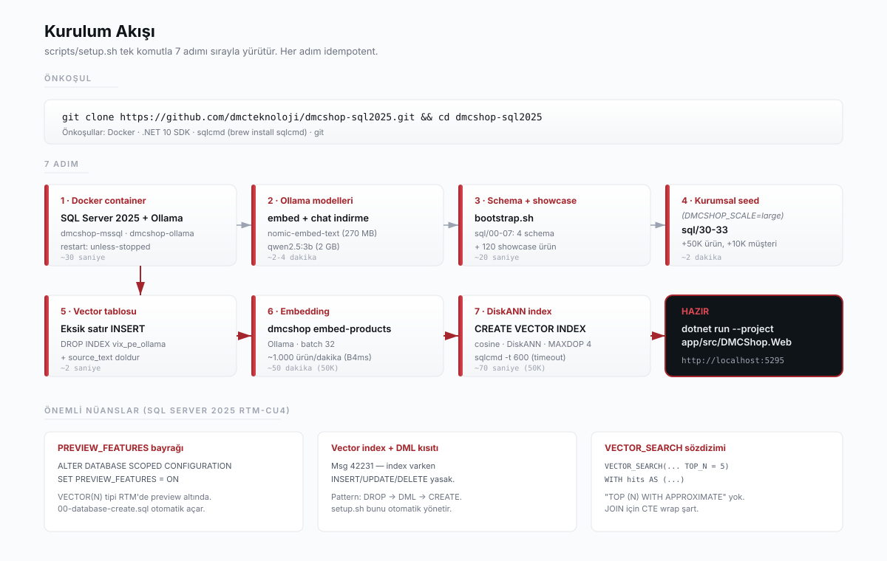

<p align="center">
  
</p>

<p align="center">
  <a href="https://learn.microsoft.com/sql/sql-server/what-s-new-in-sql-server-2025"></a>
  <a href="https://dotnet.microsoft.com/"></a>
  <a href="https://learn.microsoft.com/aspnet/core/blazor/"></a>
  <a href="https://learn.microsoft.com/ef/core/"></a>
  <a href="https://ollama.com/"></a>
  <br/>
  <a href="LICENSE"></a>
  
  
</p>

<p align="center"><a href="README.md">Türkçe</a> · <strong>English</strong></p>

> **DMCShop** is an open source reference application that shows what SQL Server 2025's built-in
> `VECTOR(N) + DiskANN` and `GRAPH MATCH + SHORTEST_PATH` features look like in production
> scenarios. **Semantic search**, **product recommendation**, a **RAG assistant** and
> **fraud ring detection** all run end to end on a single database, over an ordinary
> e-commerce catalog.

<p align="center">
  <strong>Live demo:</strong>
  <a href="https://demo.dmcteknoloji.com">https://demo.dmcteknoloji.com</a>
  <br/>
  <em>Let's Encrypt certificate · TLS-ALPN-01 challenge · auto-renewed by Caddy 2</em>
</p>

The UI is in Turkish. Every scenario page maps to a T-SQL script under `sql/`, so the SQL
Server features are readable without speaking Turkish. This file documents the whole project
in English. The table below tells you which script backs which screen.

---

## Why this repository exists

SQL Server 2025 moved vector search and graph traversal into the engine. Most material about
it stops at a syntax sample. This repository answers the next question. What does it take to
run those features in a real application, and where do they push back?

Everything here was measured on a running instance, including the parts that did not go
smoothly. See [What SQL Server 2025 taught us](#what-sql-server-2025-taught-us).

---

## Demo database scale

| Entity                 |      Count | Notes                                                                        |
| ---------------------- | ---------: | ---------------------------------------------------------------------------- |
| Category               |        100 | 10 top level x 10 sub — books, electronics, food, clothing, home, hobby, ... |
| Product                | **50,120** | 120 curated showcase products + 50,000 generated by a T-SQL CROSS JOIN        |
| Customer               |     10,050 | Randomly generated Turkish names and cities                                   |
| Order                  |    100,400 | Spread over the first four months of 2026                                     |
| Order line             |    451,202 | 4.5 lines per order on average                                                |
| Device                 |      4,080 | IP, fingerprint, user agent                                                   |
| Fraud ring (detected)  |     ~1,000 | Shared device / IP / card patterns                                            |
| Vector embedding       |      50K+  | Ollama `nomic-embed-text` (768 dim) · DiskANN cosine                          |

---

## Scenarios

| # | Scenario                              | SQL Server 2025 feature                 | Page          | T-SQL                                             |
| - | ------------------------------------- | --------------------------------------- | ------------- | ------------------------------------------------- |
| 1 | **Semantic product search**           | `VECTOR_SEARCH` + DiskANN               | `/search`     | [`sql/20-vector-search.sql`](sql/20-vector-search.sql) |
| 2 | **RAG product assistant**             | Retrieval + streaming chat              | `/asistan`    | [`sql/21-rag-assistant.sql`](sql/21-rag-assistant.sql) |
| 3 | **Fraud ring detection**              | `GRAPH MATCH` + `SHORTEST_PATH`         | `/fraud`      | [`sql/22-fraud-ring.sql`](sql/22-fraud-ring.sql)  |
| 4 | **Customers who bought this**         | `GRAPH MATCH`, 2-hop                    | `/urun/{id}`  | [`sql/23-graph-co-purchase.sql`](sql/23-graph-co-purchase.sql) |
| 5 | **Hybrid recommendation**             | `VECTOR_SEARCH` + `GRAPH MATCH`, one SELECT | `/bana-ozel` | [`sql/24-personalized.sql`](sql/24-personalized.sql) |

A sixth page, `/olcum`, measures the demo while you look at it: query latency for each
scenario (first run versus warmed up), row counts and disk footprint per table, and the vector
index as the catalog views report it. Every number is read at request time, nothing is
hardcoded, and it performs no writes.

Scenario 1 runs hybrid retrieval: DiskANN pulls roughly 300 cosine-nearest candidates, then a
keyword-overlap rerank is applied. The page shows a classic `LIKE` column next to it, which
returns nothing for most natural language queries.

---

## Architecture

<p align="center">
  
</p>

Three layers on a single VM (Azure, westeurope). The local docker-compose stack is identical.

### Scenario 2: RAG assistant flow



### Scenario 3: fraud ring detection



### Scenario 5: vector and graph hybrid in one SELECT

```mermaid
flowchart LR
    M[Customer's last N orders] --> E[Fetch embeddings]
    E --> AVG[Centroid computed in .NET]
    AVG --> VS[VECTOR_SEARCH TOP_N=30]
    VS --> F[Filter: not already purchased]
    F --> GR[GRAPH MATCH co-purchase count]
    GR --> H{Hybrid score: distance + 1/&#40;1+social&#41;}
    H --> UI[/bana-ozel · top 10 recommendations/]
```



The centroid is computed in .NET on purpose: SQL Server 2025 has no public `AVG` aggregate for
the `VECTOR` type (`Msg 8117`, still the case on CU8).

---

## Quick start

### Local, one command

Prerequisites: Docker · .NET 10 SDK · `sqlcmd` (`brew install sqlcmd`).

```bash
git clone https://github.com/dmcteknoloji/dmcshop-sql2025.git
cd dmcshop-sql2025

./scripts/setup.sh                       # showcase (120 products, ~3 min)
# or
DMCSHOP_SCALE=large ./scripts/setup.sh   # enterprise scale (50K products, ~45 min)

dotnet run --project app/src/DMCShop.Web # http://localhost:5295
```

`setup.sh` is idempotent and handles containers, models, schema, seed, embeddings and the
DiskANN index.

**About the SA password.** There is no default password in this repository. On first run
`scripts/sa-password.sh` generates a random one and stores it in `scripts/.env` with mode
`0600`. That file is git-ignored and Docker Compose reads it automatically. Set
`DMCSHOP_SA_PASSWORD` yourself if you prefer. Run `docker compose up` without either and it
stops with an explicit message. There is no weak fallback to land on.

- Step-by-step setup and troubleshooting: [docs/01-getting-started.md](docs/01-getting-started.md)
- Workshop handbook, a 60-90 minute tour with T-SQL samples: [docs/handbook.md](docs/handbook.md)

<p align="center">
  
</p>

### Azure, Bicep + cloud-init

```bash
az login
./infra/deploy.sh    # resource group, VM, cloud-init, rsync, bootstrap, embeddings
```

Details in [infra/README.md](infra/README.md). Use `./infra/sync.sh` for subsequent code
updates and `./infra/teardown.sh` to remove everything. `deploy.sh` generates a fresh random
SA password on every deployment and keeps it in `/etc/dmcshop/web.env` (mode `0600`) on the
VM. The `appsettings.json` files carry a placeholder, never a real credential.

---

## Project layout

```
dmcshop-sql2025/
├── sql/                          # SQL Server 2025 scripts (single source of truth)
│   ├── 00-database-create.sql    # PREVIEW_FEATURES = ON, schemas
│   ├── 01-04                     # shop · graph · vector · ops schemas
│   ├── 05-07                     # showcase seed (120 products)
│   ├── 08-create-vector-indexes  # DiskANN, created after embedding
│   ├── 10-11                     # ops.sp_embed_text · ops.sp_chat_complete
│   ├── 12-create-external-model  # EXTERNAL MODEL for AI_GENERATE_EMBEDDINGS
│   ├── 20-24                     # T-SQL for the five scenarios
│   ├── 30-33                     # enterprise scale seed (50K products, 10K customers)
│   └── 40-retention              # purge proc for vector.query_log and rest_call_log
├── app/                          # .NET 10 solution (DMCShop.slnx)
│   ├── src/
│   │   ├── DMCShop.Domain        # entities and abstractions (database agnostic)
│   │   ├── DMCShop.Data          # EF Core 10 DbContext and configurations
│   │   ├── DMCShop.Providers     # OpenAI and Ollama adapters (embed, chat, streaming)
│   │   ├── DMCShop.Search        # Vector · GraphRecommend · Rag · FraudRing · Personalized
│   │   ├── DMCShop.Api           # Minimal API (planned)
│   │   ├── DMCShop.Web           # Blazor Server, six pages
│   │   └── DMCShop.Cli           # CLI: seed, embed-products, health
│   └── tests/                    # xUnit unit tests and Testcontainers integration tests
├── infra/                        # Azure deployment
│   ├── main.bicep                # VM, VNet, NSG, public IP
│   ├── cloud-init.yaml           # Docker, .NET 10, sqlcmd, systemd unit
│   ├── deploy.sh                 # first-time deployment
│   ├── caddy/                    # HTTPS reverse proxy (Let's Encrypt)
│   └── security-hardening.md     # NSG narrowing, Key Vault, log retention, VM schedule
├── scripts/
│   ├── setup.sh                  # one-command local setup
│   ├── sa-password.sh            # resolves or generates the SA password
│   ├── bootstrap.sh              # runs sql/ files through sqlcmd
│   ├── docker-compose.yml        # mssql + ollama
│   ├── vm-schedule.sh            # az vm start/stop helper
│   └── backup.sh                 # BACKUP DATABASE with 7-day rotation
└── docs/
```

---

## Development

```bash
dotnet build app/DMCShop.slnx                       # whole solution
dotnet test  app/tests/DMCShop.Tests.Unit           # 21 unit tests, no database needed
dotnet test  app/tests/DMCShop.Tests.Integration    # 9 tests against a real SQL Server 2025
```

The integration tests start a SQL Server 2025 CU8 container through Testcontainers and assert
the three engine behaviours documented below: DML blocked while a DiskANN index exists, no
`AVG` aggregate over `VECTOR`, and `VECTOR_SEARCH` output needing a CTE before you join to it.
If a future cumulative update changes any of them, those tests go red and tell you this
document has gone stale. The image tag is pinned for the same reason the Compose file pins it.

`TreatWarningsAsErrors` is on and NuGet auditing fails the build on a known vulnerable package,
so a build that succeeds locally also passes CI. GitHub Actions runs the build, the unit tests,
a dependency audit and a hardcoded-credential scan on every push and pull request.

Integration tests stay out of CI because Testcontainers pulls a multi-gigabyte SQL Server
image. Run those locally.

---

## What SQL Server 2025 taught us

Three behaviours worth knowing before you build on this. All three were first hit on RTM-CU4
and re-measured on CU8 (build 17.0.4075.5) on 2026-09-04. None of them changed.

1. **The `VECTOR` type needs the preview flag.**
   ```sql
   ALTER DATABASE SCOPED CONFIGURATION SET PREVIEW_FEATURES = ON;
   ```

2. **While a DiskANN vector index exists, the table accepts no DML at all.** `Msg 42231`, and
   it applies to INSERT, UPDATE and DELETE alike. The only path is `DROP INDEX`, then the DML,
   then `CREATE VECTOR INDEX` again. The CLI `embed-products` command handles this
   automatically, which is why `sql/08-create-vector-indexes.sql` is a separate file for bulk
   loads.

3. **`VECTOR_SEARCH` syntax.** The older `TOP (N) WITH APPROXIMATE` form is gone. `TOP_N` is a
   parameter of `VECTOR_SEARCH`, and its output must be wrapped in a CTE before you can join to
   it. Joining directly fails with `Invalid column name`.
   ```sql
   WITH hits AS (
       SELECT * FROM VECTOR_SEARCH(
           TABLE      = vector.product_embedding,
           COLUMN     = embedding_ollama_768,
           SIMILAR_TO = @q,
           METRIC     = 'cosine',
           TOP_N      = 5)
   )
   SELECT h.product_id, p.name, h.distance
   FROM   hits h JOIN shop.product p ON p.product_id = h.product_id
   ORDER BY h.distance;
   ```

A fourth, less obvious one: the version badge in the UI reads `SERVERPROPERTY` at runtime. It
used to be hardcoded, the Compose tag was `2025-latest`, and the engine silently moved to CU8
while the page still claimed CU4. The image tag is now pinned.

---

## License and contact

[MIT](LICENSE) · © 2026 [Çağlar Özenç](https://www.linkedin.com/in/caglarozenc) and
[DMC Bilgi Teknolojileri](https://dmcteknoloji.com)

Companion book (Turkish, free): **SQL Server 2025: Herkes İçin, Her Rol İçin**,
at [dmcteknoloji/sql-server-2025-kitap](https://github.com/dmcteknoloji/sql-server-2025-kitap)

Contact: `iletisim@dmcteknoloji.com`
