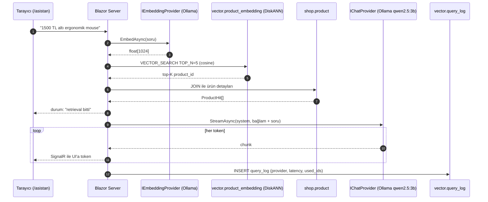
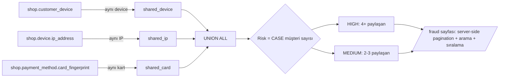

<p align="center">
  
</p>

<p align="center">
  <a href="https://learn.microsoft.com/sql/sql-server/what-s-new-in-sql-server-2025"></a>
  <a href="https://dotnet.microsoft.com/"></a>
  <a href="https://learn.microsoft.com/aspnet/core/blazor/"></a>
  <a href="https://learn.microsoft.com/ef/core/"></a>
  <a href="https://ollama.com/"></a>
  <a href="https://azure.microsoft.com/"></a>
  <br/>
  <a href="LICENSE"></a>
  
  
</p>

<p align="center"><strong>Türkçe</strong> · <a href="README.en.md">English</a></p>

> **DMCShop**, SQL Server 2025'in yerleşik `VECTOR(N) + DiskANN` ve `GRAPH MATCH + SHORTEST_PATH`
> özelliklerinin üretim senaryolarındaki karşılığını gösteren açık kaynak referans uygulamadır.
> Klasik bir e-ticaret kataloğu üzerinde **anlamsal arama**, **ürün önerisi**, **RAG asistan**
> ve **fraud ring tespiti** uçtan uca aynı veri tabanı üzerinde çalışır.

<p align="center">
  <strong>Canlı demo:</strong>
  <a href="https://demo.dmcteknoloji.com">https://demo.dmcteknoloji.com</a>
  <br/>
  <em style="font-size: 0.85em;">Let's Encrypt sertifikası · TLS-ALPN-01 challenge · Caddy 2 ile otomatik yenileme</em>
</p>

---

## Demo veri tabanı ölçeği

| Entity              |     Adet | Açıklama                                                            |
| ------------------- | -------: | ------------------------------------------------------------------- |
| Kategori            |      100 | 10 ana × 10 alt — kitap, elektronik, gıda, giyim, ev, hobi, ...     |
| Ürün                | **50.120** | 120 showcase (kategori başına kurgulanmış somut isim + açıklama) + 50.000 T-SQL CROSS JOIN üreteç |
| Müşteri             |   10.050 | Türkçe rastgele ad-soyad-şehir                                      |
| Sipariş             |  100.400 | 2026 ilk 4 ayına yayılmış                                           |
| Sipariş satırı      |  451.202 | Ortalama 4.5 satır/sipariş                                          |
| Cihaz               |    4.080 | IP, parmak izi, user-agent                                          |
| Fraud ring (tespit) |    ~1000 | Paylaşılan cihaz / IP / kart desenleri                              |
| Vector embedding    |    50K+ | Ollama `bge-m3` (1024 dim) · DiskANN cosine                |

---

## Senaryolar

| # | Senaryo                          | Özellik                                          | UI                                                   |
| - | -------------------------------- | ------------------------------------------------ | ---------------------------------------------------- |
| 5 | **Sana özel · hibrit öneri**     | `VECTOR_SEARCH` + `GRAPH MATCH` (tek SELECT)      | [`/bana-ozel`](sql/24-personalized.sql)              |
| 1 | **Semantik ürün arama**          | `VECTOR_SEARCH` + DiskANN                         | [`/search`](docs/02-senaryo-semantic-search.md)      |
| 2 | **RAG tabanlı ürün asistanı**    | Retrieval + chat (streaming)       | [`/asistan`](docs/03-senaryo-rag-asistan.md)         |
| 3 | **Fraud ring tespiti**           | `GRAPH MATCH` + `SHORTEST_PATH`    | [`/fraud`](docs/04-senaryo-fraud-ring.md)            |
| 4 | **Bunu alanlar bunu da aldı**    | `GRAPH MATCH` 2-hop                | [`/urun/{id}`](docs/05-senaryo-co-purchase.md)       |

Ayrıca `/olcum` sayfası demoyu siz bakarken ölçüyor: her senaryonun sorgu süresi (ilk koşu ve
ısınmış hali), tablo başına satır sayısı ve disk kullanımı, vektör indeksinin katalog
görünümlerindeki hali. Sunucu sürümü, çekirdek sayısı ve bellek de oradan okunuyor; hiçbiri
koda gömülü değil ve sayfa hiçbir yazma yapmıyor.

---

## Mimari

<p align="center">
  
</p>

Üç katman, tek VM (Azure B4ms westeurope · 4 vCPU / 16 GB RAM). Local docker-compose ile **aynı stack**.

### Senaryo 2 — RAG asistanı akışı



### Senaryo 3 — Fraud ring tespiti



### Senaryo 4 — Co-purchase 2-hop

```mermaid
flowchart LR
    P1((Ürün p1)) <-.purchased.- C((Müşteri))
    C -.purchased.-> P2((Ürün p2))
    P1 -- MATCH p1 ← purchased ← c → purchased → p2 --> Q[Sıralı sonuç]
    Q --> UI[/urun/&#123;id&#125; · Bunu alanlar bunu da aldı/]
```



### Senaryo 5 — Vector + Graph hibrit (tek SELECT)

```mermaid
flowchart LR
    M[Müşterinin son N siparişi] --> E[Embedding'leri al]
    E --> AVG[.NET centroid hesapla]
    AVG --> VS[VECTOR_SEARCH TOP_N=30]
    VS --> F[Filter: zaten alınmış değil]
    F --> GR[GRAPH MATCH co-purchase sayısı]
    GR --> H{Hibrit skor: distance + 1/&#40;1+social&#41;}
    H --> UI[/bana-ozel · TOP 10 öneri/]
```



---

## Hızlı başlangıç

### Local — Tek komut

Önkoşullar: Docker · .NET 10 SDK · `sqlcmd` (`brew install sqlcmd`).

```bash
git clone https://github.com/dmcteknoloji/dmcshop-sql2025.git
cd dmcshop-sql2025

./scripts/setup.sh                       # showcase (120 ürün, ~3 dk)
# veya
DMCSHOP_SCALE=large ./scripts/setup.sh   # kurumsal (50K ürün, ~45 dk)

dotnet run --project app/src/DMCShop.Web # http://localhost:5295
```

`setup.sh` idempotent: container + model + schema + seed + embedding + DiskANN index hepsini yönetir.

Tek makinede SQL Server ve Ollama birlikte çalıştığı için bellek paylaştırılmış durumda:
`OLLAMA_KEEP_ALIVE=-1` sohbet modelini bellekte tutuyor (yaklaşık 2,5 GB) ve buna karşılık
`sql/09-server-memory.sql` SQL Server'a 3 GB tavan koyuyor. Tavan olmadan ikisi aynı belleği
ister ve OOM killer genelde önce veritabanını düşürür. Daha büyük makinede iki değeri de
büyütün.

- **Adım adım kurulum + sorun giderme**: [docs/01-getting-started.md](docs/01-getting-started.md)
- **Workshop handbook (60-90 dk senaryo turu + T-SQL kod örnekleri)**: [docs/handbook.md](docs/handbook.md)

<p align="center">
  
</p>

### Azure — Bicep + cloud-init

```bash
az login
./infra/deploy.sh                  # tek komutla: RG + VM + cloud-init + rsync + bootstrap + embed
```

Detay: [infra/README.md](infra/README.md). `./infra/sync.sh` ile sonraki güncellemeler, `./infra/teardown.sh` ile tek komutla siler.

---

## Proje yapısı

```
dmcshop-sql2025/
├── sql/                          # SQL Server 2025 betikleri (tek truth source)
│   ├── 00-database-create.sql    # PREVIEW_FEATURES = ON, schema
│   ├── 01-04                     # shop · graph · vector · ops schema'ları
│   ├── 05-07                     # showcase seed (120 ürün)
│   ├── 08-create-vector-indexes  # DiskANN (embed sonrası)
│   ├── 10-11                     # ops.sp_embed_text · ops.sp_chat_complete
│   ├── 12-create-external-model  # AI_GENERATE_EMBEDDINGS için EXTERNAL MODEL
│   ├── 20-24                     # 5 senaryo T-SQL örnekleri
│   ├── 30-33                     # kurumsal ölçek seed (50K ürün, 10K müşteri)
│   └── 40-retention              # vector.query_log + rest_call_log purge proc
├── app/                          # .NET 10 solution
│   └── src/
│       ├── DMCShop.Domain        # entity + abstraction (DB-agnostic)
│       ├── DMCShop.Data          # EF Core 10 DbContext + configurations
│       ├── DMCShop.Providers     # OpenAI ve Ollama adapter'leri (embed + chat + streaming)
│       ├── DMCShop.Search        # Vector · GraphRecommend · RagAssistant · FraudRing · Personalized
│       ├── DMCShop.Api           # Minimal API (planlı)
│       ├── DMCShop.Web           # Blazor Server — 6 sayfa
│       └── DMCShop.Cli           # dmcshop CLI: seed, embed-products, health
├── infra/                        # Azure deployment
│   ├── main.bicep                # VM + VNet + NSG + Public IP
│   ├── cloud-init.yaml           # Docker + .NET 10 + sqlcmd + systemd unit
│   ├── deploy.sh                 # ilk kurulum
│   ├── caddy/                    # HTTPS reverse proxy (Let's Encrypt veya self-signed)
│   └── security-hardening.md     # NSG daraltma, Key Vault, log retention, scheduled VM
├── scripts/
│   ├── setup.sh                  # tek komutluk local kurulum
│   ├── bootstrap.sh              # sqlcmd ile sql/ dosyalarını çalıştırır
│   ├── docker-compose.yml        # mssql + ollama (restart: unless-stopped)
│   ├── vm-schedule.sh            # az vm start/stop helper
│   └── backup.sh                 # BACKUP DATABASE → /backups, rotation 7gün
└── docs/
    ├── 01-getting-started.md     # adım adım kurulum + sorun giderme
    ├── handbook.md               # workshop 60-90 dk turu
    └── assets/                   # banner.svg · architecture.svg · setup-flow.svg
```

---

## Yol haritası

| Milestone                          | Durum    | Tarih       |
| ---------------------------------- | -------- | ----------- |
| M1 — Skeleton (repo + schema + .NET solution) | ✓ Tamam | 2026-05-17 |
| M2 — Senaryo 1 + 4 (semantik arama + co-purchase) | ✓ Tamam | 2026-05-17 |
| UI iterasyonları (FluentUI → açık tema e-ticaret) | ✓ Tamam | 2026-05-17 |
| Azure VM deployment (Bicep + cloud-init) | ✓ Tamam | 2026-05-17 |
| M3 — Senaryo 2 + 3 (RAG + fraud) | ✓ Tamam | 2026-05-17 |
| Kurumsal ölçek (50K ürün)         | ✓ Tamam | 2026-05-18 |
| Streaming RAG + server-side pagination | ✓ Tamam | 2026-05-18 |
| Senaryo 5 (Vector + Graph hibrit) | ✓ Tamam | 2026-05-18 |
| External model + retention + smoke tests + Caddy | ✓ Tamam | 2026-05-18 |
| HTTPS (self-signed Caddy) | ✓ Tamam | 2026-05-18 |
| Custom domain + Let's Encrypt (demo.dmcteknoloji.com) | ✓ Tamam | 2026-05-18 |
| NSG SSH daraltma + SA password rotation + retention cron | ✓ Tamam | 2026-05-18 |
| Container Apps autoscale (refaktör) | Planlı  | —           |
| GitHub Actions CI (build + test + guvenlik denetimi) | ✓ Tamam | 2026-09-04 |

---

## Embedding modeli neden `bge-m3`

Demo önce `nomic-embed-text` ile çalışıyordu ve Türkçe sorgularda anlamsal arama çalışmıyordu.
Ölçüldü: "Kahvaltıda kullanabileceğim bir ürün" sorgusunda ilgili ürünlerin ortalama benzerliği
0,5924, alakasız ürünlerinki 0,6306 çıktı. Yani model alakasız ürünleri **üste** koyuyordu,
ayrım **eksi** yönde. Görev ön ekleri (`search_query:` / `search_document:`) eklemek de
kurtarmadı, ayrım -0,0277'de kaldı.

Aynı ölçüm `bge-m3` ile +0,1723. Üç kahvaltılık ürün de üç alakasız ürünün üstünde.
Belge tarafı iki dilli yazıldığı için İngilizce sorgular nomic ile de çalışıyordu; kırılan
yalnızca Türkçe sorgu tarafıydı ve demonun ana iddiası orası.

Bedeli boyutun 768'den 1024'e çıkması, yani yeni kolon ve yeniden embedding. 120 ürün
59,5 saniyede yeniden üretildi.

---

## SQL Server 2025'te yakalanan nüanslar

Aşağıdaki üç davranış `app/tests/DMCShop.Tests.Integration` altında gerçek bir SQL Server 2025
CU8 konteynerine karşı test ediliyor. Bir sonraki CU birini değiştirirse test kırmızı oluyor ve
bu metnin bayatladığını haber veriyor.

Workshop için kayda değer üç davranış:

1. **VECTOR tipi preview bayrağıyla açılır.** Database scoped configuration:
   ```sql
   ALTER DATABASE SCOPED CONFIGURATION SET PREVIEW_FEATURES = ON;
   ```
2. **DiskANN vector index varken tabloya hiçbir DML yapılamaz** (`Msg 42231` — INSERT, UPDATE
   ve DELETE hepsi reddedilir). Tek yol: önce `DROP INDEX`, sonra DML, sonra yeniden `CREATE
   VECTOR INDEX`. CLI `embed-products` bunu otomatik yönetir; manuel toplu yükleme için
   `sql/08-create-vector-indexes.sql` ayrı dosyadır.
3. **`VECTOR_SEARCH` sözdizimi.** Eski `TOP (N) WITH APPROXIMATE` RTM'de yok; yerine:
   ```sql
   WITH hits AS (
       SELECT * FROM VECTOR_SEARCH(
           TABLE      = vector.product_embedding,
           COLUMN     = embedding_bge_1024,
           SIMILAR_TO = @q,
           METRIC     = 'cosine',
           TOP_N      = 5)
   )
   SELECT h.product_id, p.name, h.distance
   FROM   hits h JOIN shop.product p ON p.product_id = h.product_id
   ORDER BY h.distance;
   ```
   Dış JOIN için VECTOR_SEARCH çıktısı CTE içinde tutulmalı.

---

## Lisans ve iletişim

[MIT](LICENSE) · © 2026 [Çağlar Özenç](https://www.linkedin.com/in/caglarozenc) & [DMC Bilgi Teknolojileri](https://dmcteknoloji.com)

Kitap: **SQL Server 2025: Herkes İçin, Her Rol İçin** — [dmcteknoloji/sql-server-2025-kitap](https://github.com/dmcteknoloji/sql-server-2025-kitap)
İletişim: `iletisim@dmcteknoloji.com`
