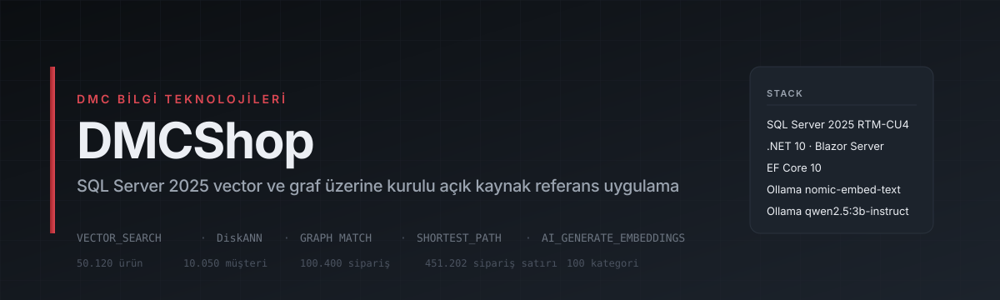
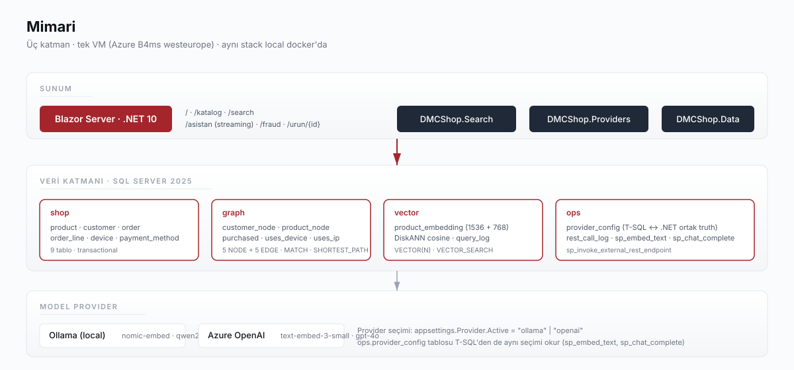
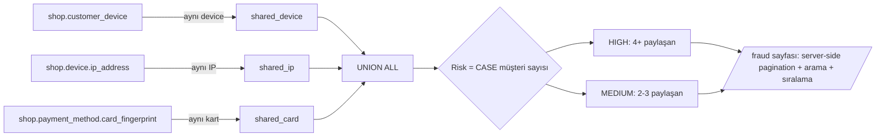

<p align="center">
  
</p>

<p align="center">
  <a href="https://learn.microsoft.com/sql/sql-server/what-s-new-in-sql-server-2025"></a>
  <a href="https://dotnet.microsoft.com/"></a>
  <a href="https://learn.microsoft.com/aspnet/core/blazor/"></a>
  <a href="https://learn.microsoft.com/ef/core/"></a>
  <a href="https://ollama.com/"></a>
  <a href="https://azure.microsoft.com/"></a>
  <br/>
  <a href="LICENSE"></a>
  
  
</p>

> **DMCShop**, SQL Server 2025'in yerleşik `VECTOR(N) + DiskANN` ve `GRAPH MATCH + SHORTEST_PATH`
> özelliklerinin üretim senaryolarındaki karşılığını gösteren açık kaynak referans uygulamadır.
> Klasik bir e-ticaret kataloğu üzerinde **anlamsal arama**, **ürün önerisi**, **RAG asistan**
> ve **fraud ring tespiti** uçtan uca aynı veri tabanı üzerinde çalışır.

<p align="center">
  <strong>Canlı demo:</strong>
  <a href="http://dmcshop-eqaspinoarx3g.westeurope.cloudapp.azure.com">
    http://dmcshop-eqaspinoarx3g.westeurope.cloudapp.azure.com
  </a>
</p>

---

## Demo veri tabanı ölçeği

| Entity              |     Adet | Açıklama                                                            |
| ------------------- | -------: | ------------------------------------------------------------------- |
| Kategori            |      100 | 10 ana × 10 alt — kitap, elektronik, gıda, giyim, ev, hobi, ...     |
| Ürün                | **50.120** | 120 showcase (elle yazılmış) + 50.000 T-SQL CROSS JOIN üreteç      |
| Müşteri             |   10.050 | Türkçe rastgele ad-soyad-şehir                                      |
| Sipariş             |  100.400 | 2026 ilk 4 ayına yayılmış                                           |
| Sipariş satırı      |  451.202 | Ortalama 4.5 satır/sipariş                                          |
| Cihaz               |    4.080 | IP, parmak izi, user-agent                                          |
| Fraud ring (tespit) |    ~1000 | Paylaşılan cihaz / IP / kart desenleri                              |
| Vector embedding    |    50K+ | Ollama `nomic-embed-text` (768 dim) · DiskANN cosine                |

---

## Senaryolar

| # | Senaryo                          | Özellik                            | UI                                                   |
| - | -------------------------------- | ---------------------------------- | ---------------------------------------------------- |
| 1 | **Semantik ürün arama**          | `VECTOR_SEARCH` + DiskANN          | [`/search`](docs/02-senaryo-semantic-search.md)      |
| 2 | **RAG tabanlı ürün asistanı**    | Retrieval + chat (streaming)       | [`/asistan`](docs/03-senaryo-rag-asistan.md)         |
| 3 | **Fraud ring tespiti**           | `GRAPH MATCH` + `SHORTEST_PATH`    | [`/fraud`](docs/04-senaryo-fraud-ring.md)            |
| 4 | **Bunu alanlar bunu da aldı**    | `GRAPH MATCH` 2-hop                | [`/urun/{id}`](docs/05-senaryo-co-purchase.md)       |

---

## Mimari

<p align="center">
  
</p>

Üç katman, tek VM (Azure B4ms westeurope · 4 vCPU / 16 GB RAM). Local docker-compose ile **aynı stack**.

### Senaryo 2 — RAG asistanı akışı


### Senaryo 3 — Fraud ring tespiti



### Senaryo 4 — Co-purchase 2-hop

```mermaid
flowchart LR
    P1((Ürün p1)) <-.purchased.- C((Müşteri))
    C -.purchased.-> P2((Ürün p2))
    P1 -- MATCH p1 ← purchased ← c → purchased → p2 --> Q[Sıralı sonuç]
    Q --> UI[/urun/&#123;id&#125; · Bunu alanlar bunu da aldı/]
```



---

## Hızlı başlangıç

### Local — Docker Compose

Önkoşullar: Docker · .NET 10 SDK · `sqlcmd` (`brew install sqlcmd`).

```bash
git clone https://github.com/dmcteknoloji/dmcshop-sql2025.git
cd dmcshop-sql2025

docker compose -f scripts/docker-compose.yml up -d
docker exec dmcshop-ollama ollama pull nomic-embed-text
docker exec dmcshop-ollama ollama pull qwen2.5:3b-instruct-q4_K_M
./scripts/bootstrap.sh                                       # schema + 120 showcase ürün
dotnet run --project app/src/DMCShop.Cli -- embed-products   # vector embedding üret
dotnet run --project app/src/DMCShop.Web                     # http://localhost:5295
```

Kurumsal ölçek (50K ürün) için ek adım:
```bash
sqlcmd -C -I -S localhost -U sa -P 'dmcShop_2026!Demo' -d dmcshop \
    -i sql/30-seed-large.sql -i sql/31-seed-large-customers.sql \
    -i sql/32-seed-large-orders.sql -i sql/33-seed-large-graph.sql
```

### Azure — Bicep + cloud-init

```bash
az login
./infra/deploy.sh                  # tek komutla: RG + VM + cloud-init + rsync + bootstrap + embed
```

Detay: [infra/README.md](infra/README.md). `./infra/sync.sh` ile sonraki güncellemeler, `./infra/teardown.sh` ile tek komutla siler.

---

## Proje yapısı

```
dmcshop-sql2025/
├── sql/                          # SQL Server 2025 betikleri (tek truth source)
│   ├── 00-database-create.sql    # PREVIEW_FEATURES = ON, schema
│   ├── 01-04                     # shop · graph · vector · ops schema'ları
│   ├── 05-07                     # showcase seed (120 ürün)
│   ├── 08-create-vector-indexes  # DiskANN (embed sonrası)
│   ├── 10-11                     # ops.sp_embed_text · ops.sp_chat_complete
│   ├── 20-23                     # 4 senaryo T-SQL örnekleri
│   └── 30-33                     # kurumsal ölçek seed (50K ürün, 10K müşteri)
├── app/                          # .NET 10 solution
│   └── src/
│       ├── DMCShop.Domain        # entity + abstraction (DB-agnostic)
│       ├── DMCShop.Data          # EF Core 10 DbContext + configurations
│       ├── DMCShop.Providers     # OpenAI ve Ollama adapter'leri (embed + chat + streaming)
│       ├── DMCShop.Search        # VectorSearch · GraphRecommend · RagAssistant · FraudRing
│       ├── DMCShop.Api           # Minimal API (planlı)
│       ├── DMCShop.Web           # Blazor Server — 5 sayfa
│       └── DMCShop.Cli           # dmcshop CLI: seed, embed-products, health
├── infra/                        # Azure deployment
│   ├── main.bicep                # VM + VNet + NSG + Public IP
│   ├── cloud-init.yaml           # Docker + .NET 10 + sqlcmd + systemd unit
│   ├── deploy.sh                 # ilk kurulum
│   ├── sync.sh                   # sonraki güncellemeler
│   └── teardown.sh               # az group delete
├── scripts/
│   ├── docker-compose.yml        # SQL Server 2025 + Ollama (restart: unless-stopped)
│   └── bootstrap.sh              # sqlcmd ile sql/ dosyalarını sırayla çalıştırır
└── docs/                         # senaryo dökümanları + assets
```

---

## Yol haritası

| Milestone                          | Durum    | Tarih       |
| ---------------------------------- | -------- | ----------- |
| M1 — Skeleton (repo + schema + .NET solution) | ✓ Tamam | 2026-05-17 |
| M2 — Senaryo 1 + 4 (semantik arama + co-purchase) | ✓ Tamam | 2026-05-17 |
| UI iterasyonları (FluentUI → açık tema e-ticaret) | ✓ Tamam | 2026-05-17 |
| Azure VM deployment (Bicep + cloud-init) | ✓ Tamam | 2026-05-17 |
| M3 — Senaryo 2 + 3 (RAG + fraud) | ✓ Tamam | 2026-05-17 |
| Kurumsal ölçek (50K ürün)         | ✓ Tamam | 2026-05-18 |
| Streaming RAG + server-side pagination | ✓ Tamam | 2026-05-18 |
| HTTPS + custom domain             | Planlı  | —           |
| Container Apps autoscale (refaktör) | Planlı  | —           |
| GitHub Actions CI/CD              | Planlı  | —           |

---

## SQL Server 2025 RTM-CU4 yakalanan nüanslar

Workshop için kayda değer üç davranış:

1. **VECTOR tipi preview bayrağıyla açılır.** Database scoped configuration:
   ```sql
   ALTER DATABASE SCOPED CONFIGURATION SET PREVIEW_FEATURES = ON;
   ```
2. **DiskANN vector index varken tabloya hiçbir DML yapılamaz** (`Msg 42231` — INSERT, UPDATE
   ve DELETE hepsi reddedilir). Tek yol: önce `DROP INDEX`, sonra DML, sonra yeniden `CREATE
   VECTOR INDEX`. CLI `embed-products` bunu otomatik yönetir; manuel toplu yükleme için
   `sql/08-create-vector-indexes.sql` ayrı dosyadır.
3. **`VECTOR_SEARCH` sözdizimi.** Eski `TOP (N) WITH APPROXIMATE` RTM'de yok; yerine:
   ```sql
   WITH hits AS (
       SELECT * FROM VECTOR_SEARCH(
           TABLE      = vector.product_embedding,
           COLUMN     = embedding_ollama_768,
           SIMILAR_TO = @q,
           METRIC     = 'cosine',
           TOP_N      = 5)
   )
   SELECT h.product_id, p.name, h.distance
   FROM   hits h JOIN shop.product p ON p.product_id = h.product_id
   ORDER BY h.distance;
   ```
   Dış JOIN için VECTOR_SEARCH çıktısı CTE içinde tutulmalı.

---

## Lisans ve iletişim

[MIT](LICENSE) · © 2026 [Çağlar Özenç](https://www.linkedin.com/in/caglarozenc) & [DMC Bilgi Teknolojileri](https://dmcteknoloji.com)

Kitap: **SQL Server 2025: Herkes İçin, Her Rol İçin** — [dmcteknoloji/sql-server-2025-kitap](https://github.com/dmcteknoloji/sql-server-2025-kitap)
İletişim: `iletisim@dmcteknoloji.com`
